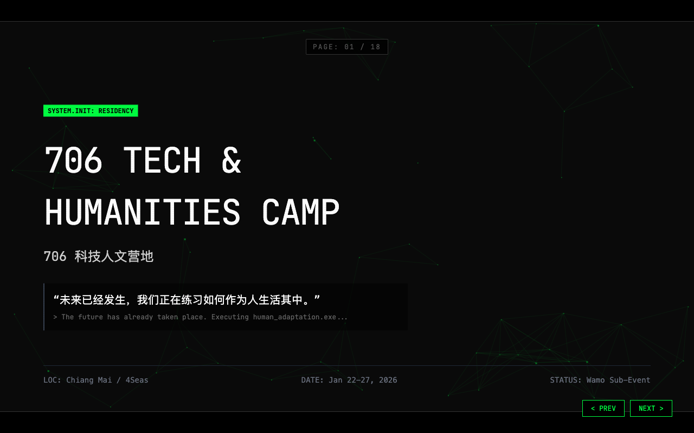

# 706 Tech & Humanities Camp · 议程 Deck

**706 科技人文营地 · Maritime Odyssey**

给技术浪潮加一层批判性反思的 5 天营地。2026 年 1 月 22–27 日 · 泰国清迈。

**🔗 在线预览：<https://wang-xiaochuan.github.io/Wamo2026/>**



---

## 为什么用「奥德修斯下冥界」作隐喻

> 古希腊的英雄奥德修斯，在海路被封锁之际，在喀耳刻的建议中进入冥界寻求指引。
> 今天，我们站在一个类似的时刻。技术不再只决定生死，而开始接管判断、重塑关系。

Deck 用「越过冥河」串起整场讨论：**这不是承诺彼岸的救赎，而是承认此岸已无法维持。**

> 如果我们还能从冥河中返回，那并不是因为我们看见了一个完美的未来，
> 而是因为我们从冥界里，带回了继续前行所必需的**判断**。

## 活动定位

嵌套在清迈科技月（Chiang Mai Tech Month）的生态里：

```
Chiang Mai Tech Month
└── ETH Chiang Mai          ← 以太坊建设者的快闪城市
    └── Wamo Summit         ← 瓦猫之夏
        └── 706 Tech & Humanities   ← 本营地
```

- **时间**：2026 年 1 月 22–27 日
- **地点**：泰国清迈 / 4Seas，HQ 在 One Nimman Area
- **主办**：706 青年空间 × Wamo 瓦猫之夏
- **两条使命**：给技术浪潮加一层批判性反思（Reflection Layer）· 连接学者与 Web3/AI 社群（Deep Linkage）

**形式**：无中心，无观众，只有节点。清迈全城即自组织营地。

| 模块 | 内容 |
|------|------|
| Deep-Dive Panels | 白天深度对谈 |
| Town Halls | 晚上社区问答 |
| Low-structure Living | 低结构共居 |

**"下午论坛对话，晚上社区讨论"**——每个论坛都邀请**社科人文领域的学者**与**技术一线的实践者**同场对话。

## 5 个主题日

| 日期 | 主题 | 晚间 Town Hall |
|------|------|---------------|
| JAN 22 | **Tech & Judgment** 技术与判断 | Judgment Systems |
| JAN 23 | **Accelerationism & Shock** 加速主义与冲击 | Pain & Speed |
| JAN 24 | **Intimacy, Trust & Algorithm** 亲密关系、信任与算法 | Digital Love |
| JAN 25 | **Labor, Meaning & Automation** 劳动、意义与自动化 | Post-Work |
| JAN 26 | **China as the Future of Humanity** 中国作为未来人类的一种范式 | Final Town Hall |

每个主题都由一句核心追问驱动：

| 主题 | 追问 |
|------|------|
| 技术与判断 | 当判断被系统接管，人还是否需要为结果负责？ |
| 加速主义与冲击 | 加速之所以成立，不是因为它带来进步，而是因为它把痛苦变成了个人问题 |
| 亲密关系、信任与算法 | 当关系可以被排序、推荐和管理，亲密还是一种选择吗？ |
| 劳动、意义与自动化 | 当意义取代金钱成为主要激励，劳动真的更自由了吗？ |
| 中国作为未来人类的一种范式 | 如果未来已经发生在某些地方，我们是否真的愿意成为那种人？ |

## 确认嘉宾

<details>
<summary>12 位确认嘉宾（点击展开）</summary>

| 嘉宾 | 身份 |
|------|------|
| Vitalik Buterin | 以太坊联合创始人 |
| 项飙 | 德国普朗克社会人类学研究所所长 |
| 方可成 | 新闻实验室 & 过滤气泡主理人 |
| 黄孙权 | 中国美术学院网络社会研究所所长 |
| 熊浩 | 复旦大学法学院副教授 |
| 孙哲 | 上海财经大学经济社会学系副教授 |
| 姚建华 | 复旦大学新闻学院副教授 |
| 石可 | 南京大学全球人文研究院副教授 |
| Helena Rong | 上海纽约大学互动媒体与商学助理教授 |
| 刘锋 | Web3 101 主播，BODL Ventures 合伙人 |
| 王超 | Metropolis DAO 联合发起人 |
| mashbean 豆泥 | 分散式科技与数位自主权探索者 |

</details>

## 目标产出

| # | 产出 | 说明 |
|---|------|------|
| 01 | **明确的问题** | 留下一组被清楚表达、可被反复引用的问题，而非简单的结论 |
| 02 | **可流通的内容** | 播客、长视频、短视频切片与双语讨论文集 |
| 03 | **深度连接** | 在共同经历中建立的、基于智性诚实的真实关系 |

<details>
<summary>关于 706 青年空间</summary>

中国最早的自治青年空间，2012 年至今。起源于北京五道口，
现已发展为遍布全球（柏林、纽约、东京等）的分布式青年网络。

> 连接孤岛，探索生活的可能性。在原子化时代重建公共生活与深度对话。

</details>

## 技术说明

- **单个 `index.html`，18 页滚动式 deck，自包含**
- 样式与内容全部内联，无构建步骤、无外部依赖，离线可用
- 通过 GitHub Pages 部署（Settings → Pages → `main` 分支 `/ (root)`）
- 排版使用系统字体栈，不加载外部字体
